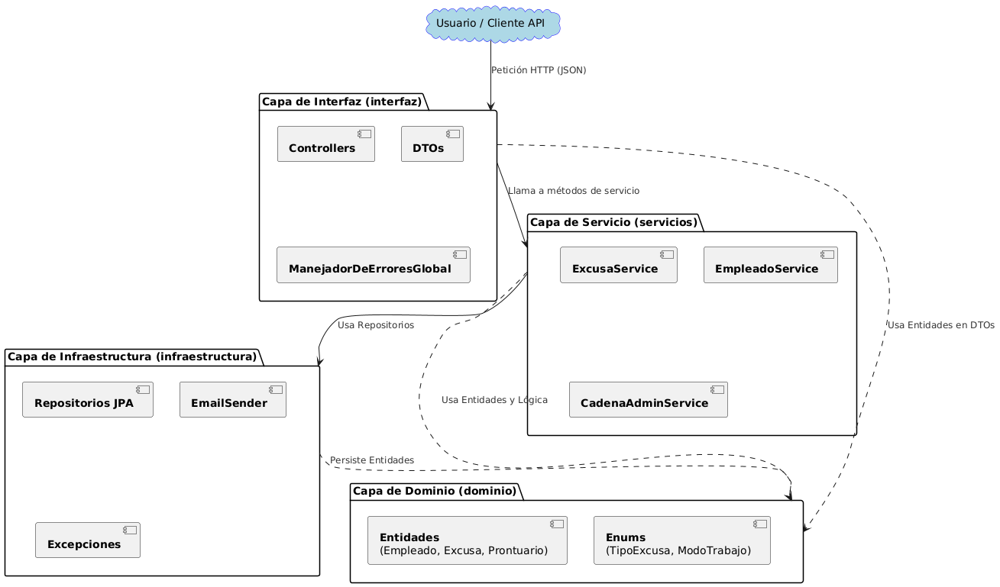

# parcial2-ds
Proyecto para la materia Diseño de Sistemas

Integrantes: Ariel Jorge Lescano

github link: https://github.com/ArielL777/parcial2-ds/tree/dev

# Proyecto Sistema de Excusas - Parcial 2

Este proyecto implementa un sistema para la gestión de excusas utilizando Spring Boot.

## Refactorización y Mejoras

Se realizaron las siguientes correcciones y mejoras sobre la base del Parcial 1:

* El CEO ya no crea el prontuario; ahora delega esta responsabilidad al `AdministradorProntuarios`.
* La clase `Empleado` ahora es concreta, eliminando la necesidad de `IEmpleado` y simplificando la jerarquía del modelo.
* Se centralizó la lógica de envío de emails en un método dentro de `EncargadoAbstracto` para eliminar código duplicado.
* Se eliminó el método `getPrimerEncargado()` de la cadena para mejorar el encapsulamiento.
* El patrón `Template Method` fue movido a `EncargadoAbstracto`, ahora los `ModoTrabajo` actuan como hooks.
* Se corrigió el `ModoProductivo` para que envíe el email al CTO siempre que delega una excusa, independientemente de si podría procesarla o no.
* Se eliminó la clase `GestorExcusas`, ya que era una capa de abstracción innecesaria.
* La responsabilidad de `AdministradorProntuarios` fue dividida en dos clases (`AdministradorProntuarios` para persistencia y `NotificadorCEO` para notificaciones) para evitar la doble responsabilidad.
=======
* La responsabilidad de `AdministradorProntuarios` fue dividida en dos clases (`AdministradorProntuarios` para persistencia y `NotificadorCEO` para notificaciones) para evitar la doble responsabilidad.

### Diagrama de Arquitectura

### Diagrama de Casos de Uso

### Diagrama de Clases
